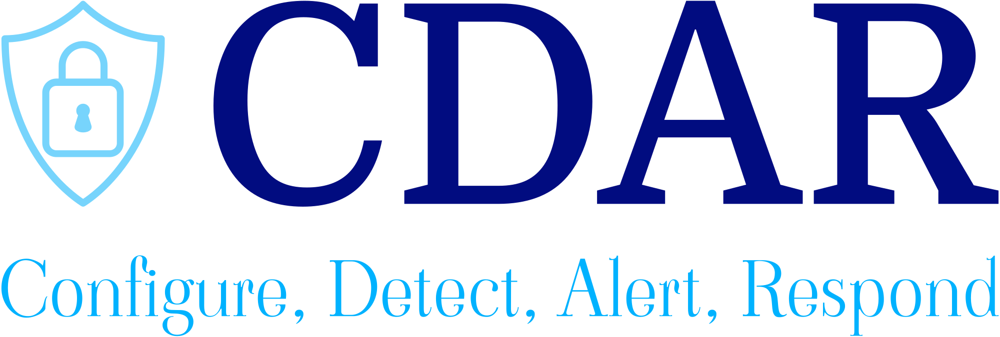

# CDAR (Configure, Detect, Alert, and Respond)

CDAR is a comprehensive GitHub repository dedicated to providing an end-to-end solution for addressing security threats and techniques outlined in the Mitre ATT&CK Framework. This repository is designed to help organizations configure their systems, cloud, networks, and applications to generate the necessary logs, establish robust detection and alerting mechanisms, and implement response strategies for efficient incident handling.

## Table of Contents
- [Introduction](#introduction)
- [CDAR Overview](#cdar-overview)
- [Repository Structure](#repository-structure)
- [Getting Started](#getting-started)
- [Contributing](#contributing)
- [License](#license)

## Introduction

Cybersecurity is of paramount importance in today's digital landscape, and organizations need to be proactive in securing their assets. The CDAR repository aims to provide a holistic approach to cybersecurity by guiding users through the processes of configuration, detection, alerting, and response to potential security threats.

## CDAR Overview

### Configuration
The Configuration section of CDAR focuses on providing guidance on configuring various aspects of your infrastructure to generate the necessary logs for effective security monitoring. It covers:

- Configuring Operating Systems to produce relevant security event logs.
- Configuring Cloud services securely to log activities and events.
- Network configurations to ensure logs capture relevant network traffic.
- Application configurations to minimize vulnerabilities and generate security logs.

### Detection
The Detection section assists in log collection and normalization. It provides instructions on how to:

- Set up log collection mechanisms to gather logs from various sources.
- Normalize logs for consistent and coherent analysis.
- Utilize detection rules to identify potential security threats and anomalies.

### Alerting
Alerting in CDAR provides predefined queries used in Security Information and Event Management (SIEM) systems. These queries are designed to generate alerts for specific security events. We employ the SIGMA detection format (https://github.com/SigmaHQ/sigma) for creating vendor-agnostic SIEM queries, ensuring compatibility with a variety of SIEM solutions.

### Response
The Response section offers examples of incident response playbooks that can be implemented in Security Orchestration, Automation, and Response (SOAR) systems. These playbooks guide you through effective response actions to mitigate, contain, and remediate security incidents.

## Repository Structure

- `/configuration`
  - Contains guidelines and best practices for configuring systems, cloud services, networks, and applications to generate security logs.
  
- `/detection`
  - Provides scripts and tools for log collection, normalization, and detection rule creation.
  
- `/alerting`
  - Includes SIEM queries and alerting rules, following the SIGMA standard.
  
- `/response`
  - Offers incident response playbooks and examples for SOAR systems.

## Getting Started

To get started with CDAR, follow these steps:

1. Clone or fork the repository to your local environment.
2. Explore the relevant sections - Configuration, Detection, Alerting, and Response - based on your organization's requirements.
3. Follow the provided instructions and guidelines to configure, detect, alert, and respond to security incidents effectively.

## Contributing

We welcome contributions from the cybersecurity community. If you have improvements, additional content, or suggestions, please open a pull request. Refer to the [Contribution Guidelines](CONTRIBUTING.md) for more information on how to contribute.

## License

CDAR is licensed under the [MIT License](LICENSE), which means it's open-source and free to use. Please review the license terms before using the content provided in this repository.

For more information about the Mitre ATT&CK Framework, visit [Mitre ATT&CK](https://attack.mitre.org/).

Thank you for choosing CDAR as your cybersecurity resource. Stay secure and vigilant!
